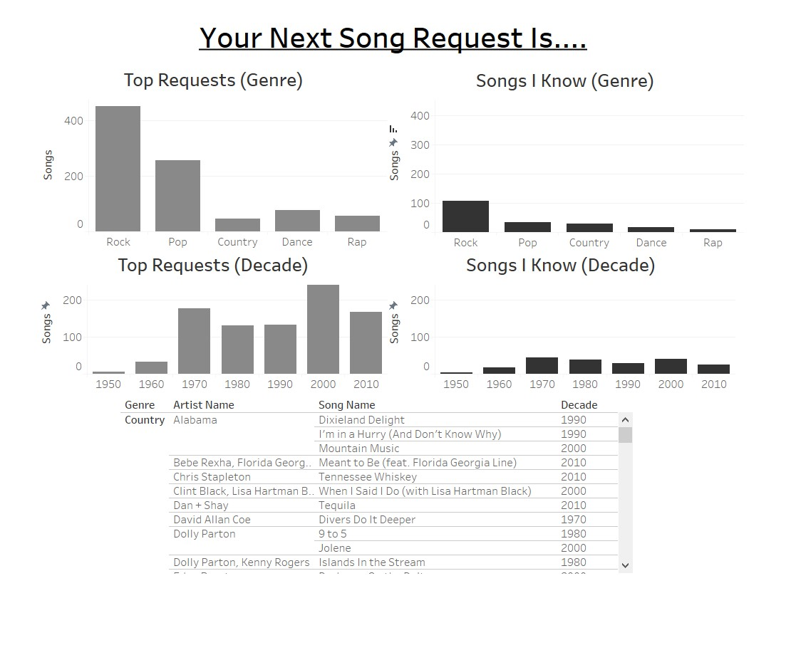
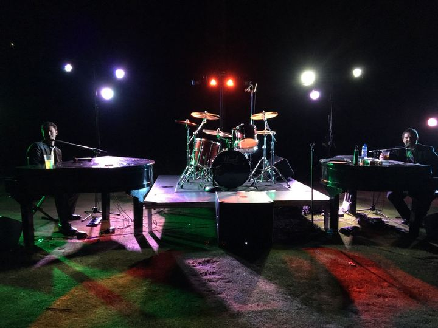

# DuelingTableauPiano
How many songs can you perform? Do you know enough songs? This dashboard answers that question (with a solid "NO! Practice more!")

## Table of contents
* [General info](#general-info)
* [The Data](#the-data)
* [Screenshots](#screenshots)
* [Technologies](#technologies)
* [Features](#features)
* [Status](#status)
* [Inspiration](#inspiration)

## General info
I've been working as a Dueling Piano entertainer since 2015. Dueling Pianos is an all request, all sing-along, clap-along, dance-along show that heavily focuses on audience participation.  
Two singing piano players take all the song requests in real time and turn that into a fun interactive show. Since we never know ahead of time what an audience will want to hear, the challenge is always: what song should I learn next?

A typical Dueling Piano set up

## The Data
I pulled song lists off of Spotify. Using my personal knowledge as an industry insider I was able to filter over 20 playlists of "Important songs to know" for dueling piano players. I combined these into one master list of nearly 1,000 songs and exported that list to Excel. After cleaning up titles, removing duplicates, simplifying decades, and adding genre information the list was ready to be loaded into Tableau. 

I also used my own personal list of songs I know as a test case for comparison. 

## Screenshots

## Technologies
* Tableau Desktop - Professional Edition 2020.4.2
* Microsoft Excel - 2019
* Spotify - Desktop App 2021

## Features
List of features ready and TODOs for future development
* Mousing over Genre or Decade bars shows how many songs are in each category
* Clicking a Genre or Decade bar filters the list at the bottom of the dashboard, allowing the user to see the Song, Artist, Genre, and Decade information
* Using the "Songs I Know" lists on the right side of the dashboard, I can compare my personal list to the master list and see where my knowledge gaps are
* Clicking an individual artist or song on the list will show where it shows up on both the master and personal list

To-do list:
* Add a search bar so specific songs can be located quickly
* Option where songs link to Spotify 
* Option where songs link to Ultimate-Guitar app for chord chart access

## Status
Project is: On Hold: Completed for Tableau assignment for class. Once Covid19 distancing measures are over and large gatherings can safely resume I will play shows again. When that happens I will need this dashboard to help me keep track of what to learn next! 

## Inspiration
Every time I've looked at a song request and said to myself "Why don't I know that one yet?"

